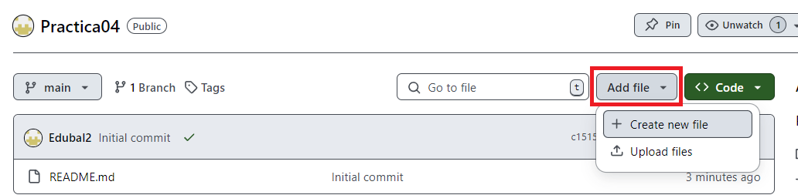

# Practica04
1º DAW - Eduard Balici

### Introducción
En esta practica vamos a ver como crear y utilizar las Pages de GitHub las cuales son un servicio gratuito de host de paginas web estaticas

## Primera Parte
Creamos un repositorio para la practica 4 con un archivo readme

Una vez creado

