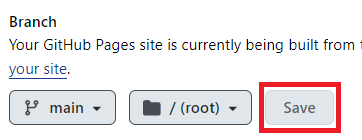
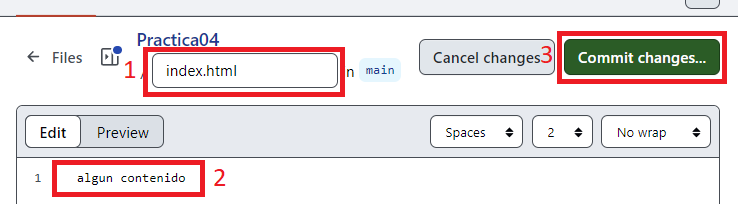

 
# Practica04
1º DAW - Eduard Balici

### Introducción
En esta práctica vamos a ver cómo crear y utilizar las Pages de GitHub las cuales son un servicio gratuito de host de páginas web estáticas.

## Primera Parte
Creamos un repositorio para la practica 4 con un archivo README.md.

Una vez creado clicamos en **settings**, en el menú de la izquierda **pages** y donde pone **none** elegimos la opción **main** o **master**.

Y clicamos en guardar **save**

Tras unos instantes al refrescar la página nos cargara un link de la página web el cual es el que mostraremos al público ya que simplemente muestra el contenido final.

 

Hacemos clic en add file para añadir un archivo en el repositorio.

 

Lo nombramos index.html que es el que contiene la página web.
Se trata de un HTML porque he decido a hacer la practica como originalmente la haríamos.

Este sería el link de la pagina
https://edubal2.github.io/Practica04/
 
